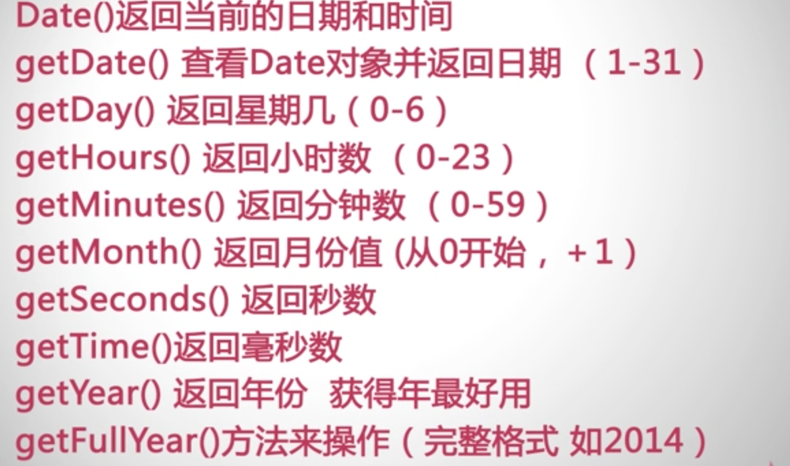

HTML+CSS

1. 从CSS 样式代码插入的形式来看基本可以分为以下3种：内联式、嵌入式和外部式三种,他们的优先级：内联式 > 嵌入式 > 外部式
2. css样式表就是把css代码直接写在现有的HTML标签中
3. D选择器都类似于类选择符，但也有一些重要的区别：1、为标签设置id="ID名称"，而不是class="类名称"。2、ID选择符的前面是井号（#）号，而不是英文圆点（.）。
4.  类和id选择器的区别：
    相同点：可以应用于任何元素
    
    不同点：
  1、ID选择器只能在文档中使用一次。与类选择器不同，在一个HTML文档中，ID选择器只能使用一次，而且仅一次。而类选择器可以使用多次。
  
  2、可以使用类选择器词列表方法为一个元素同时设置多个样式。我们可以为一个元素同时设多个样式，但只可以用类选择器的方法实现，ID选择器是不可以的（不能使用 ID 词列表）。
  
1. ul-li是没有前后顺序的信息列表
2.  ">" 作用于元素的第一代后代，"空格"作用于元素的所有后代。
3.  标签的权值为1，类选择符的权值为10，ID选择符的权值最高为100。
4.  在CSS中，html中的标签元素大体被分为三种不同的类型：块状元素、内联元素(又叫行内元素)和内联块状元素
  
  * 常用的块状元素有：```<div>、<p>、<h1>...<h6>、<ol>、<ul>、<dl>、<table>、<address>、<blockquote> 、<form>```
  * 常用的内联元素有：```<a>、<span>、<br>、<i>、<em>、<strong>、<label>、<q>、<var>、<cite>、<code>```
  * 常用的内联块状元素有：```、<input>```

  * 
块级元素特点：1、每个块级元素都从新的一行开始，并且其后的元素也另起一行。（真霸道，一个块级元素独占一行）2、元素的高度、宽度、行高以及顶和底边距都可设置。3、元素宽度在不设置的情况下，是它本身父容器的100%（和父元素的宽度一致），除非设定一个宽度。

  * 内联元素特点：1、和其他元素都在一行上；2、元素的高度、宽度及顶部和底部边距不可设置；3、元素的宽度就是它包含的文字或图片的宽度，不可改变。 
  * inline-block 元素特点：1、和其他元素都在一行上；2、元素的高度、宽度、行高以及顶和底边距都可设置。3、在行内，避免换行。
* 盒子模型的边框就是围绕着内容及补白的线，这条线你可以设置它的粗细、样式和颜色(边框三个属性)。
* 元素有三种布局模型：
1、流动模型（Flow）
2、浮动模型 (Float)
3、层模型（Layer）
* 流动布局模型具有2个比较典型的特征：第一点，块状元素都会在所处的包含元素内自上而下按顺序垂直延伸分布，因为在默认状态下，块状元素的宽度都为100%。实际上，块状元素都会以行的形式占据位置。第二点，在流动模型下，内联元素都会在所处的包含元素内从左到右水平分布显示。
* 块状元素：1.定宽：可以通过设置“左右margin”值为“auto”来实现居中的  2.不定宽：1.加入table标签（利用table标签的长度自适标准文档流 浮动 绝对定位应性）  2.设置 display: inline 方法：与第一种类似，显示类型设为 行内元素，进行不定宽元素的属性设置 3.设置 position:relative 和 left:50%：利用 相对定位 的方式，将元素向左偏移 50% ，即达到居中的目的
* CSS中 存在三种定位机制：标准文档流 浮动 绝对定位
* 清除浮动：clear：both (适用于紧邻的元素) overflow：hidden（父元素和紧邻的元素）
* 相对定位：不会脱离标准文档流，绝对定位会脱离标准文档流
* 绝对定位：完全脱离标准文档流，兄弟元素不再受其影响，absolute和fixed都是绝对定位
    * absolute 如果有已经定位的祖先元素，以已经定位的，距离最近的祖先元素作为偏移参考基准。无已经定位的祖先元素，以html为参考基准；当有滚动条时，位置会随着滚动条变化
    * fixed 以浏览器的可视窗口作为参考基准；位置不会随着滚动条变化
*  JS 输出空格```
1.document.write("&nbsp;&nbsp;"+"1"+"&nbsp;&nbsp;&nbsp;&nbsp;"+"23"); 2. document.write("<span style='white-space:pre;'>"+"  1        2    3    "+"</span>");```
* confirm prompt
* window.open([URL], [窗口名称], [参数字符串])
  * ```URL：可选参数，在窗口中要显示网页的网址或路径。如果省略这个参数，或者它的值是空字符串，那么窗口就不显示任何文档。
窗口名称：可选参数，被打开窗口的名称。
    1.该名称由字母、数字和下划线字符组成。
    2."_top"、"_blank"、"_selft"具有特殊意义的名称。
       _blank：在新窗口显示目标网页
       _self：在当前窗口显示目标网页
       _top：框架网页中在上部窗口中显示标网页
    3.相同 name 的窗口只能创建一个，要想创建多个窗口则 name 不能相同。
    4.name 不能包含有空格。
参数字符串：可选参数，设置窗口参数，各参数用逗号隔开。```
* DOM：文档对象模型DOM（Document Object Model）定义访问和处理HTML文档的标准方法。DOM 将HTML文档呈现为带有元素、属性和文本的树结构（节点树）
  * 三种常见的DOM节点：1. 元素节点：上图中<html>、<body>、<p>等都是元素节点，即标签。 2. 文本节点:向用户展示的内容，如<li>...</li>中的JavaScript、DOM、CSS等文本。  3. 属性节点:元素属性，如<a>标签的链接属性href="http://www.imooc.com"。
* innerHTML 属性用于获取或替换 HTML 元素的内容。
* indexOf() 方法可返回某个指定的字符串值在字符串中首次出现的位置。
* Math.round(x) 四舍五入
* random() 方法可返回介于 0 ~ 1（大于或等于 0 但小于 1 )之间的一个随机数
* 数组方法
* window对象方法：

* history对象： 保存曾经浏览过的页面url
    * 属性：length，url数量
    * 方法：1.back（）2.forward() 3.go();
* nextSibling 属性可返回某个节点之后紧跟的节点（处于同一树层级中）。previousSibling 属性可返回某个节点之前紧跟的节点（处于同一树层级中）。
* 获取宽高：
  ```var w= document.documentElement.clientWidth|| document.body.clientWidth;```  ```var h= document.documentElement.clientHeight|| document.body.clientHeight;```
* scrollLeft:设置或获取位于给定对象左边界与窗口中目前可见内容的最左端之间的距离 ，即左边灰色的内容。

  scrollTop:设置或获取位于对象最顶端与窗口中可见内容的最顶端之间的距离 ，即上边灰色的内容。

  offsetLeft:获取指定对象相对于版面或由 offsetParent 属性指定的父坐标的计算左侧位置 。

  offsetTop:获取指定对象相对于版面或由 offsetParent 属性指定的父坐标的计算顶端位置 。
* 添加事件的方法：
  * 1.HTML事件处理程序，HTML 与JS耦合度太高  
  *  2.DOM0级事件处理程序，先获取变量，在给变量添加事件，各个版本的浏览器通用。
  *  3.DOM2级事件处理程序，addEventListener() removeEventListenr(); 例：btn3.addEventListener('click', showmes, false);三个参数：第一个是添加事件，需要去掉‘on’，第二个是 调用的函数， 第三个，bool表示是否是捕获事件，false表示是冒泡事件。DOM2 级，可以添加多个响应事件。
  *  4.IE事件处理程序：attachEvent() detachEvent()，两个参数，第一个事件处理名称，第二个调用的函数。例：btn3.attachEvent('onclick', mes);
  *  5.跨浏览器的解决方法：定义一个对象，封装两个方法，一个添加，一个删除，对不同的方法进行判断，然后进行添加或删除。例：```var eventUtil = {
  addHandler:function(element, type,handler) {
  if(element.addEventListener) {
  //Dom2
  }
  else if (element.attachEvent) {
  // IE
  } else {
  // Dom0
  }
  }}```
* DOM中的事件 对象：
  * type:获取事件 的类型
  * target：获取事件 的目标
  * 阻止冒泡：执行完操作之后，调用：event.stopPropagation();
  * 阻止默认行为：event.preventDefault();
* IE 中的事件 对象：
  * type
  * srcElement ：获取事件的目标
  * cancelBubble属性：阻止事件的冒泡，设置为ture表示阻止
  * returnValue属性：阻止事件的默认行为，设置为false表示阻止默认行为。
* clientX clientY 表示鼠标在浏览器中的坐标
* 运动（动画）：
  * 速度
  * 缓冲运动
  * 多物体运动
  * 任意值变化
  * 链式运动
* date -- 

## jQuery
* :contains(text)过滤选择器, 内容选择器
* :has(selector)过滤选择器,使用包含的元素名称来过滤
* :visible过滤选择器,获取的是全部可见的元素
* [attribute=value]属性选择器
* [attribute*=value]属性选择器,获取属性值中包含指定内容的全部元素
* :text表单文本选择器
* :radio单选按钮选择器
* selected选中状态选择器
* 使用html()和text()方法操作元素的内容，当两个方法的参数为空时，表示获取该元素的内容，而如果方法中包含参数，则表示将参数值设置为元素内容,html()方法可以获取元素的HTML内容,text()方法只是获取元素中的文本内容
* 通过addClass()和css()方法可以方便地操作元素中的样式，前者括号中的参数为增加元素的样式名称，后者直接将样式的属性内容写在括号中


 


